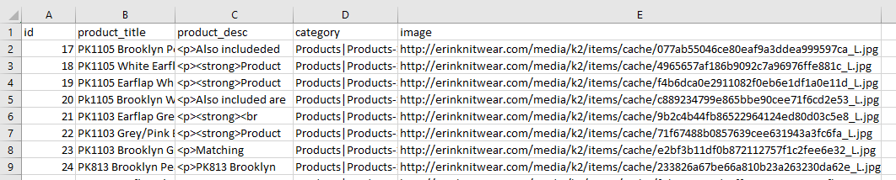
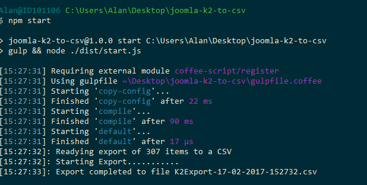

# Joomla K2 Item To CSV Exporter

This was build for a specific use case; In its current form it will export the name, description and category and image url of each `published` item and write them to a CSV file. It can easily be modified to export more items to the CSV however.


### Example exported CSV


### Requirements
Node v4.5 +
NPM v3.0 +
Joomla Database needs to be running on MySQL or MariaDB

### How it works
The script esentially connects to the Joomla database, retrieves all items within the relevant scope, modifys them slightly to account for categories and image urls and writes them to a CSV. The DB queries are paged to a maximum of 25 items from the DB are retrieved and wrote to a CSV at a time.

### Base configuration

To run the script "as is", modify the `src/dbconfig.json` file. Fill in your database login info, the name of your K2 items table and the name of your K2 category table. You'll also need to modify the `baseImgURL` to point to your Joomla site.

The `baseImgSize` and `imgExtension` properties mean that the prograsm will only be able to output correct image urls if all the image sizes and filetypes are the same. If your using a mix of image sizes (options are S, M, L, XL etc..) and a range of formats (.jpg, .png, .gif etc..) you will need to modify the script to account for this or the outputted image urls will be incorrect.

### Running the script


To run the script, first open a terminal in the root of the directory and run `npm i -g gulp && npm i`

After the dependencies are installed, run `npm start` to build and run the program. It will start executing as soon as its built.

### Modifying the Script
If you need to modify the script to include extra fields, or remove certain items, the parts you should look at are

```
/src/db.coffee
```
This file contains all the functions for querying the database. To change which fields are returned about K2 items, look at the `getItemsInIDRange` function and modify as needed.


```
/src/exporter.coffee
```
This file carries out the whole exporting process. Look at the `processResults` function for changing how each item returned from the database is modified.

If you change which fields are returned from the database, you do not need to modify anything to do with writing to the CSV.
